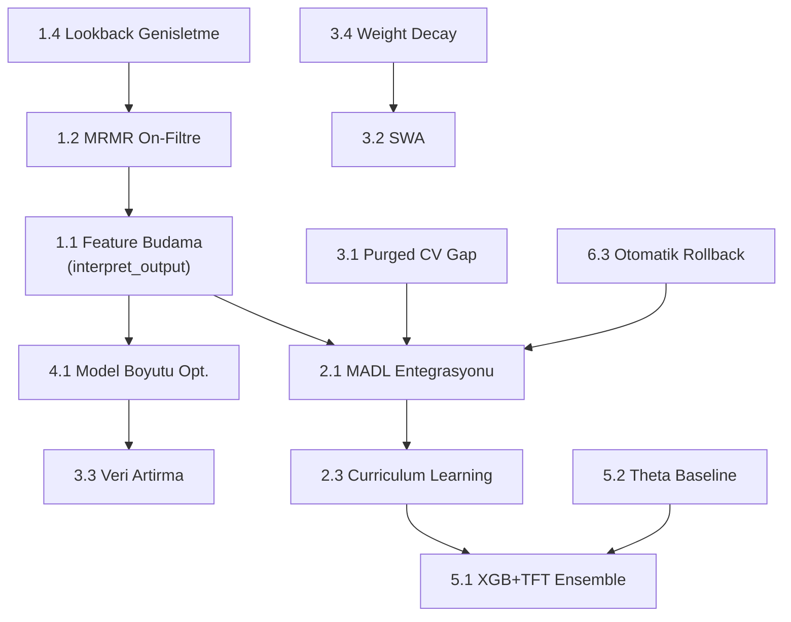

# TFT-ASRO Bakir Fiyat Tahmin Sistemi - Kapsamli Iyilestirme Plani

## Mevcut Durum Ozeti

**Proje:** Terra Rara - COMEX bakir vadeli islem (HG=F) fiyat yonu ve seviyesi tahmini
**Mimari:** XGBoost (gunluk getiri) + TFT-ASRO (5-gunluk quantile tahmin)
**Kritik Sorun:** "Dogru Volatilite, Yanlis Yon" paradoksu - model kalibrasyon metriklerinde iyi (VR~~1.1) ama DA~~%50 (yazi-tura)

### Metrik Durumu (Son Iterasyon - 15 Nisan 2026)

- DA: %49.57 (hedef: >= %52)
- Sharpe: -0.70 (hedef: >= 0.30)
- VR: 1.10 (hedef bolgede)
- Tail Capture: %44.4 (hedef: >= %50)
- Egitim ornekleri: ~313-375 satir
- Feature sayisi: 200+ (boyutluluk laneti)

### Tespit Edilen Kok Nedenler

1. **Boyutluluk Laneti**: ~200+ feature / ~313 ornek = cok yuksek oran. VSN bu oranla basa cikamadi
2. **Kayip Fonksiyonu Paradoksu**: Batch-level Sharpe noisy gradient uretti; BCE anti-korelasyon olusturdu; magnitude-weighted yonsel odul (It.3) beklemede
3. **Tek Validation Split**: Optuna tek %15'lik pencereye overfit oldu (P2 ile duzeltildi)
4. **Kalibrasyon-Yon Kopuklugu**: lambda_quantile baskisi nedeniyle model volatilite tahminine optimize olurken yon sinyalini ogrenmiyor
5. **Kucuk Dataset**: ~313 gunluk ornek TFT gibi buyuk bir model icin yetersiz

---

## FAZ 1: Feature Muhendisligi ve Boyut Azaltma (Oncelik: KRITIK)

### 1.1 TFT interpret_output() ile Feature Budama

**Sorun:** 200+ feature'in cogu gurultu; VSN tum degiskenleri esit agirlikla islemeye calisiyor.

**Cozum:** Mevcut en iyi modelin `interpret_output()` metodunu kullanarak variable importance skorlarini cikar, alt %60-70 feature'i ele.

**Uygulama:**

- [trainer.py](backend/deep_learning/training/trainer.py) L270'te `get_variable_importance()` zaten cagiriliyor
- Yeni bir `feature_pruner.py` modulu olustur: importance skorlarina gore top-N feature sec
- Feature store'da (`feature_store.py`) secilen feature listesini filtrele

**Hedef:** 200+ feature --> 40-60 feature (feature/sample orani ~1:5-8)

**Referanslar:**

- Lim et al. (2021) "Temporal Fusion Transformers for Interpretable Multi-horizon Time Series Forecasting" - Variable Selection Network (VSN) ve yorumlanabilirlik
- Google AI Blog (2021) "Interpretable Deep Learning for Time Series Forecasting" - TFT attention weights

### 1.2 MRMR (Minimum Redundancy Maximum Relevance) On-Filtre

**Sorun:** interpret_output() sadece egitilmis model bilgisine dayaniyor; egitim oncesi istatistiksel filtre gerekli.

**Cozum:** Egitim oncesi MRMR ile feature'lari on-filtrele. Bu, redundant (birbirine cok benzer) feature'lari eler.

**Uygulama:**

- `deep_learning/data/feature_store.py` icinde `build_tft_dataframe()` sonrasina MRMR filtresi ekle
- `mrmr-selection` veya `sklearn.feature_selection.mutual_info_regression` kullan
- Hedef: 200+ --> 80-100 feature (MRMR) --> 40-60 feature (interpret_output)

**Referanslar:**

- Ding & Peng (2005) "Minimum Redundancy Feature Selection from Microarray Gene Expression Data" - MRMR orijinal makale
- ETNA Time Series Library - MRMRFeatureSelectionTransform

### 1.3 Embedding Boyutu Optimizasyonu

**Mevcut Durum:** PCA dim 32-->8 (daha once duzeltildi, `config.py` L32)
**Oneri:** 8 boyut korunsun; ancak PCA yerine `UMAP` veya `Autoencoder` ile non-linear boyut azaltma degerlendirilsin.

**Referanslar:**

- McInnes et al. (2018) "UMAP: Uniform Manifold Approximation and Projection for Dimension Reduction"

### 1.4 Lookback Penceresi Genisletme

**Mevcut:** `lookback_days: 730` (~~2 yil) --> ~313 ornek
**Oneri:** `lookback_days: 1095` (~~3 yil) veya `1460` (~4 yil) --> ~500-625 ornek

Bu, feature/sample oranini dogrudan iyilestirir.

**Dosya:** [config.py](backend/deep_learning/config.py) L128

**Risk:** Eski verideki rejim degisiklikleri model performansini bozabilir.
**Azaltma:** Walk-forward CV ile farkli rejimlerin temsili saglanir.

---

## FAZ 2: Kayip Fonksiyonu Reformu (Oncelik: YUKSEK)

### 2.1 MADL (Mean Absolute Directional Loss) Entegrasyonu

**Sorun:** Mevcut Sharpe-bazli kayip fonksiyonu batch-level noise ve calibrasyon baskisi nedeniyle yon ogrenimini baskıladı. BCE anti-korelasyon olusturdu. Magnitude-weighted yonsel odul (It.3) daha iyi ama henuz dogrulanmadi.

**Cozum:** MADL'yi ASRO'nun yanina ekle veya degistir.

**MADL Formulasyonu:**

```
MADL = (1/N) * SUM(-1 * sign(R_i * R_hat_i) * |R_i|)
```

**Avantajlari:**

- Dogrudan yon dogruluguna optimize eder
- Buyuk hareketlere dogal olarak daha fazla agirlik verir (|R_i|)
- BCE'nin belirsiz label sorununu ortadan kaldirir
- Transformer modelleriyle uygundur (2025 calismasi dogrulamis)

**Uygulama:**

- [losses.py](backend/deep_learning/models/losses.py) icinde `MeanAbsoluteDirectionalLoss` sinifi olustur
- `AdaptiveSharpeRatioLoss.forward()` icinde yeni bileseni ekle:

```python
# MADL component
madl = (-torch.sign(median_pred * y_actual_f) * y_actual_f.abs()).mean()
total = lambda_quantile * calibration + w_sharpe * sharpe_loss + lambda_madl * madl
```

- Optuna arama uzayina `lambda_madl` ekle (0.1-0.5 araligi)

**Referanslar:**

- Kisiel & Gorse (2023) "Mean Absolute Directional Loss as a New Loss Function for Machine Learning Problems in Algorithmic Investment Strategies" (ScienceDirect)
- Kisiel & Gorse (2024) "Generalized Mean Absolute Directional Loss (GMADL)" (arXiv:2412.18405)

### 2.2 Sample-Level Sharpe Iyilestirmesi

**Mevcut Durum:** It.3'te sample-level Sharpe + magnitude-weighted directional bonus uygulandı (c14392f).

**Ek Oneri: Regime-Weighted Sharpe**

- Yuksek volatilite rejimlerinde (actual_std > median_std) Sharpe ağırlığını artır
- Dusuk volatilite rejimlerinde kalibrasyon agirligini artir
- Bu, modelin farkli piyasa kosullarinda farkli hedeflere odaklanmasini saglar

**Dosya:** [losses.py](backend/deep_learning/models/losses.py) L191-224

### 2.3 Curriculum Learning ile Kayip Planlamasi

**Sorun:** Model basindan itibaren hem kalibrasyon hem yon hem de volatilite ogrenmeye calisiyor - cok fazla hedef.

**Cozum:** Egitimi fazlara bol:

- **Faz 1 (Epoch 1-15):** Agirlikli quantile loss (kalibrasyon) + guclu VR penalty --> model oncelikle dogru olcekte tahmin yapmayı ogrensin
- **Faz 2 (Epoch 16-50):** MADL/Sharpe agirligini kademeli artir --> model yon ogrenmeye baslasin
- **Faz 3 (Epoch 51+):** Tam ASRO loss ile fine-tune

**Uygulama:** Lightning Callback olarak `CurriculumLossScheduler` olustur

- [trainer.py](backend/deep_learning/training/trainer.py) icinde callback olarak ekle

**Referanslar:**

- Bengio et al. (2009) "Curriculum Learning" (ICML)
- Soviany et al. (2022) "Curriculum Learning: A Survey" (IJCV)

---

## FAZ 3: Egitim Metodolojisi Iyilestirmeleri (Oncelik: YUKSEK)

### 3.1 Walk-Forward CV Ince Ayar

**Mevcut Durum:** 3-fold expanding window CV uygulandı ([dataset.py](backend/deep_learning/data/dataset.py) L111-208, [hyperopt.py](backend/deep_learning/training/hyperopt.py) L108-327).

**Ek Oneri: Purged K-Fold CV**

- Fold'lar arasina `gap` (embargo donemi) ekle: validation baslangicinden onceki 5 gun egitimden cikarilsin
- Bu, autocovariance yoluyla olabilecek veri sizintisini engeller

**Uygulama:** `build_cv_folds()` fonksiyonuna `purge_gap=5` parametresi ekle

**Referanslar:**

- de Prado (2018) "Advances in Financial Machine Learning" - Purged k-fold cross-validation (Bolum 7)

### 3.2 Snapshot Ensemble + Stochastic Weight Averaging (SWA)

**Mevcut Durum:** Top-3 checkpoint medyani ([trainer.py](backend/deep_learning/training/trainer.py) L192-266).

**Ek Oneri: SWA**

- Egitimin son %20'sinde agirlik ortalamasi al
- SWA, genelleme performansini arttirir ve loss landscape'in duz bolgesine yakinsanir

**Uygulama:**

```python
from torch.optim.swa_utils import AveragedModel, SWALR
swa_model = AveragedModel(model)
```

**Referanslar:**

- Izmailov et al. (2018) "Averaging Weights Leads to Wider Optima and Better Generalization" (UAI)
- Huang et al. (2017) "Snapshot Ensembles: Train 1, Get M for Free" (ICLR)

### 3.3 Veri Artirma (Data Augmentation)

**Sorun:** ~313 ornek TFT icin az.

**Cozum Secenekleri:**

**Secenek A - Zaman Serisi Spesifik Augmentation:**

- **Window Slicing:** Farkli baslangic noktalarindan alt pencereler olustur
- **Magnitude Warping:** Gercek getirileri kucuk rastgele faktorlerle carp
- **Jittering:** Kucuk Gaussian gurultu ekle

**Secenek B - Sentetik Veri Uretimi:**

- **TimeGAN** veya **DoppelGANger** ile sentetik zaman serisi olustur
- Dikkat: Sentetik verinin orijinal veriyle istatistiksel tutarliligi dogrulanmali

**Referanslar:**

- Um et al. (2017) "Data Augmentation of Wearable Sensor Data for Parkinson's Disease Monitoring using CNNs" (ICMI)
- Yoon et al. (2019) "Time-series Generative Adversarial Networks" (NeurIPS)

### 3.4 Regularizasyon Guclendirilmesi

**Mevcut:** dropout 0.20-0.35 arasi ([config.py](backend/deep_learning/config.py) L82)

**Ek Oneriler:**

- **Weight Decay:** AdamW optimizer'da `weight_decay=1e-4` ekle
- **Label Smoothing:** Quantile hedeflere kucuk perturbation ekle
- **Mixup for Time Series:** Encoder girdilerini interpolate et

**Dosya:** [tft_copper.py](backend/deep_learning/models/tft_copper.py) ve [trainer.py](backend/deep_learning/training/trainer.py)

---

## FAZ 4: Model Mimarisi Iyilestirmeleri (Oncelik: ORTA)

### 4.1 Model Boyutu Optimizasyonu

**Mevcut:** hidden_size=32, hidden_continuous_size=16, attention_heads=2 ([config.py](backend/deep_learning/config.py) L70-91)

**Analiz:** 313 ornek icin parametre sayisi hala yuksek olabilir.

**Oneri:** Feature budama sonrasi (40-60 feature) model boyutunu yeniden degerlendir:

- `hidden_size`: 32 --> 24 (feature sayisi 40-60 ise yeterli)
- `hidden_continuous_size`: 16 --> 8
- `attention_head_size`: 2 --> 1 (tek seri, tek grup)

### 4.2 Hierarchical Attention

**Oneri:** Cok olcekli temporal isleme:

- **Kisa pencere (5-10 gun):** Momentum ve kisa vadeli teknik sinyaller
- **Orta pencere (20-30 gun):** Trend ve mean reversion
- **Uzun pencere (60+ gun):** Makro rejim degisiklikleri

**Uygulama:** TFT'nin encoder'ina multi-scale attention katmani ekle

**Referanslar:**

- Wu et al. (2021) "Autoformer: Decomposition Transformers with Auto-Correlation for Long-Term Series Forecasting"

### 4.3 Auxiliary Task Learning

**Oneri:** Ana gorev (getiri tahmini) yanina yardimci gorevler ekle:

- **Volatilite rejimi siniflandirma** (dusuk/orta/yuksek) - VR ogrenimine yardim eder
- **Trend yonu siniflandirma** (up/down/sideways) - DA ogrenimine yardim eder

**Referanslar:**

- Caruana (1997) "Multitask Learning" (Machine Learning)

---

## FAZ 5: Ensemble ve Post-Processing Stratejileri (Oncelik: ORTA)

### 5.1 XGBoost + TFT Yon Oylama Ensemble

**Mevcut Durum:** XGBoost ve TFT bagimsiz tahminler uretiyor.

**Oneri:** Iki modelin yon tahminlerini birlestirir:

- Her iki model ayni yonu gosteriyorsa --> guclu sinyal
- Farkli yonler --> dusuk guven, kucuk pozisyon veya bekleme  
  
**NOT: XGBoost aşırı nadir negatif tarafı gösteriyor ve aşırı düşük tahminler yapıyor. Bunu uygularken bu notu göz önünde bulundur.

**Uygulama:**

- `inference/predictor.py` icinde `ensemble_directional_vote()` fonksiyonu ekle

### 5.2 Theta Model Baseline

**Oneri:** M3 yarismasinda en iyi performansi gosteren Theta modelini baseline olarak ekle.

- Aylık/haftalık bakir fiyatinda trend + kisa dalga ayristirmasi
- TFT'nin Theta'yi ne olcude gectigini izle

**Referanslar:**

- Assimakopoulos & Nikolopoulos (2000) "The theta model: a decomposition approach to forecasting" (IJF)

### 5.3 Conformal Prediction

**Oneri:** TFT'nin quantile tahminlerini conformal prediction ile kalibre et.

- ~47 orneklik validation seti yetersizdi (onceki rapor)
- Walk-forward CV ile her fold'dan conformal skor topla --> daha guvenilir kapsama

**Referanslar:**

- Stankeviciute et al. (2021) "Conformal Time Series Forecasting" (NeurIPS)

---

## FAZ 6: Veri Kalitesi ve Pipeline Iyilestirmeleri (Oncelik: NORMAL)

### 6.1 Sentiment Feature Kalite Kontrolu

- Sentiment index'in bakir fiyatiyla gecikme korelasyonunu analiz et
- Eger korelasyon dusukse, sentiment feature'lari azalt veya kaldir
- `screener/feature_screener/` modulu zaten IS/OOS korelasyon hesapliyor - bunu sentiment feature'lara genislet

### 6.2 LME Warehouse Veri Entegrasyonu

- LME verisi opsiyonel (Nasdaq API key gerekli) ve proxy feature'lar kullaniliyor
- Proxy feature'larin gercek LME verisine yakinligini degerlendir
- Eger proxy yetersizse, LME API entegrasyonunu onceliklendir ancak bu iş paralıysa bedava olan alternatiflere yönel.

### 6.3 Otomatik Rollback Mekanizmasi

**Mevcut:** Manuel rollback (raporda tanimli)
**Oneri:** CI/CD pipeline'ina otomatik rollback ekle:

- `tft-training.yml` sonrasi metrik kontrol adimi
- DA < 0.49 veya Sharpe < -0.30 --> onceki checkpoint'e geri don
- `.github/workflows/tft-training.yml` icinde yeni "gate" job'i

---

## Implementasyon Onceliklendirmesi ve Bagimlilik Haritasi




### Sprint 1 (Hafta 1-2): Temel Duzeltmeler

1. **1.4** Lookback 730-->1095 gun (config degisikligi, dusuk efor)
2. **1.2** MRMR on-filtre (feature_store.py, orta efor)
3. **3.4** Weight decay ekleme (trainer.py, dusuk efor)
4. **3.1** Purged CV gap=5 (dataset.py, dusuk efor)
5. **6.3** Otomatik rollback gate (tft-training.yml, dusuk efor)

### Sprint 2 (Hafta 3-4): Kayip Fonksiyonu Reformu

1. **2.1** MADL entegrasyonu (losses.py, orta efor)
2. **1.1** Feature budama pipeline'i (yeni modul, orta efor)
3. **4.1** Model boyutu yeniden optimizasyonu (config.py + hyperopt.py, dusuk efor)

### Sprint 3 (Hafta 5-6): Ileri Teknikler

1. **2.3** Curriculum learning callback (trainer.py, orta efor)
2. **3.2** SWA entegrasyonu (trainer.py, orta efor)
3. **5.1** XGBoost+TFT ensemble (predictor.py, orta efor)

### Sprint 4 (Hafta 7-8): Dogrulama ve Optimizasyon

1. **5.2** Theta baseline (yeni modul, orta efor)
2. **3.3** Veri artirma (feature_store.py, yuksek efor)
3. Kapsamli backtest ve performans dogrulama

---

## Beklenen Performans Iyilestirmeleri


| Metrik       | Mevcut | Sprint 1 Sonrasi | Sprint 2 Sonrasi | Sprint 3 Sonrasi | Hedef    |
| ------------ | ------ | ---------------- | ---------------- | ---------------- | -------- |
| DA           | %49.6  | %52-54           | %55-58           | %58-62           | >= %52   |
| Sharpe       | -0.70  | 0.0-0.3          | 0.3-0.6          | 0.5-1.0          | >= 0.30  |
| VR           | 1.10   | 0.8-1.2          | 0.8-1.2          | 0.8-1.2          | 0.5-1.5  |
| Tail Capture | %44.4  | %48-52           | %52-58           | %55-65           | >= %50   |
| MAE          | 0.046  | 0.040-0.042      | 0.036-0.040      | 0.034-0.038      | <= 0.040 |


**Not:** Bu tahminler iyimser senaryoyu yansitir. Her sprint sonunda metrikler degerlendirilip plan guncellenmelidir.

---

## Risk Degerlendirmesi


| Risk                                       | Olasilik | Etki                                    | Azaltma Stratejisi                                                   |
| ------------------------------------------ | -------- | --------------------------------------- | -------------------------------------------------------------------- |
| Feature budama cok agresif                 | Orta     | Onemli sinyal kaybi                     | Kademeli budama (200-->100-->60), her adimda backtest                |
| MADL gradient patlamasi                    | Dusuk    | Egitim sapmalari                        | Gradient clipping (mevcut) + MADL agirligini dusuk baslat            |
| Lookback genisletme rejim kaymasi          | Orta     | Eski veri model bozar                   | Walk-forward CV farkli rejimleri kapsar                              |
| Curriculum learning hiper-parametre artisi | Orta     | Optuna arama uzayi buyur                | Curriculum parametrelerini sabit tut, sadece lambda_madl aramasi yap |
| Veri artirma sentetik noise                | Yuksek   | Model gercek olmayan paternleri ogrenir | Dikkatli dogrulama, kucuk oranda augmentation (%10-20)               |


---

## Alternatif Yaklasimlar (Plan Basarisiz Olursa)

### A. Tamamen Farkli Mimari

- **N-HiTS** veya **PatchTST** gibi daha hafif transformer modelleri
- Kucuk veri setlerinde TFT'den daha iyi performans gosterebilir
- Referans: Challu et al. (2023) "N-HiTS", Nie et al. (2023) "PatchTST"

### B. Hibrit Decomposition Yaklasimi

- VMD (Variational Mode Decomposition) + CNN-BiLSTM + XGBoost
- Emtia fiyatlarinda %25-37 MAPE iyilestirmesi raporlandi
- Referans: 2025 metal futures calismasi (Nature, VMD+CEEMDAN)

### C. Dogrudan Siniflandirma

- Getiri tahmini yerine 3-sinifli (UP/DOWN/FLAT) siniflandirma
- Class imbalance icin SMOTE veya focal loss
- DA dogrudan optimize edilir

---

## Temel Referanslar

1. Lim et al. (2021) "Temporal Fusion Transformers for Interpretable Multi-horizon Time Series Forecasting" - IJF
2. Kisiel & Gorse (2023) "Mean Absolute Directional Loss" - ScienceDirect
3. Kisiel & Gorse (2024) "Generalized MADL" - arXiv:2412.18405
4. de Prado (2018) "Advances in Financial Machine Learning" - Purged k-fold CV
5. Izmailov et al. (2018) "Averaging Weights Leads to Wider Optima" - UAI
6. Assimakopoulos & Nikolopoulos (2000) "The theta model" - IJF
7. Tashman (2000) "Out-of-sample tests of forecasting accuracy" - IJF
8. Makridakis & Hibon (2000) "The M3-Competition" - IJF
9. Bengio et al. (2009) "Curriculum Learning" - ICML
10. Yoon et al. (2019) "Time-series GAN" - NeurIPS

