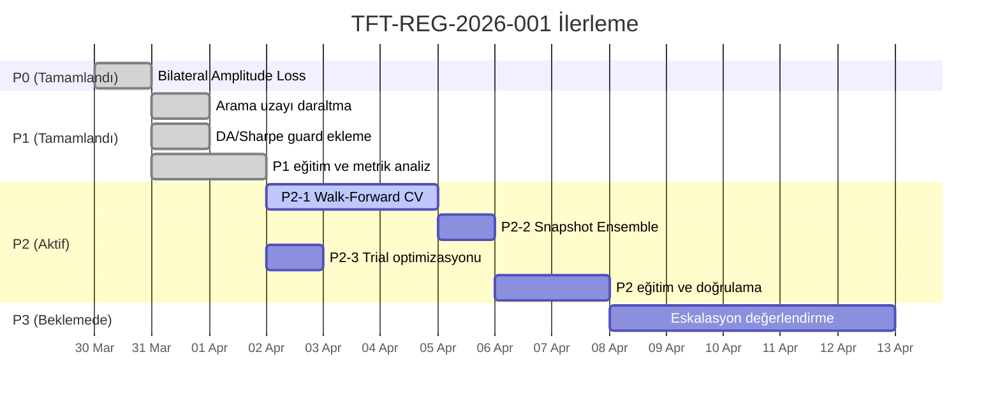

# TFT-REG-2026-001: P0/P1 Müdahale Analizi ve P2 Geçiş Planı

| Alan | Değer |
|---|---|
| **Rapor Tarihi** | 2 Nisan 2026 |
| **Rapor No** | TFT-REG-2026-001-v3 |
| **Proje** | CopperMind — Bakır Vadeli İşlem Tahmin Platformu |
| **Bağlamlar** | [Regresyon Raporu](./tft-asro-training-regression-20260331.md) · [Araştırma Sonuçları](./tft-astro-training-regression-arastirma-sonuclari-202060331.md) |
| **Durum** | 🟡 P0/P1 Tamamlandı — P2 Geçişe Hazır |

---

## Bölüm A — P0/P1 Müdahale Sonuçlarının Metrik Analizi

### A.1 Kronolojik Müdahale Zinciri

| # | Tarih | Müdahale | Commit | Seviye |
|---|---|---|---|---|
| 0 | 25 Mart | Referans eğitim (Baseline) | — | — |
| 1 | 30 Mart | Bilateral amplitude_loss (VR>1.5 ceza) | `4c80824` | P0 |
| 2 | 31 Mart (A) | Hyperopt arama uzayı daraltma + DA/Sharpe guard | `40432a3` | P1 |
| 3 | 31 Mart (B) | P1 parametreleri ile yeniden eğitim | — | P1 |

### A.2 Karşılaştırmalı Metrik Tablosu

| Metrik | Baseline (25 Mar) | P0 Eğitimi (31 Mar-A) | Δ vs Baseline | P1 Eğitimi (31 Mar-B) | Δ vs Baseline | Hedef Eşik | Durumu |
|---|---|---|---|---|---|---|---|
| **MAE** | 0.0354 | 0.0398 | 🔴 +12.4% | 0.0379 | 🟡 +7.1% | ≤ 0.040 | ⚠️ Sınırda |
| **RMSE** | 0.0409 | 0.0459 | 🔴 +12.2% | 0.0427 | 🟡 +4.4% | ≤ 0.045 | ⚠️ Sınırda |
| **Directional Accuracy** | 0.5087 | 0.4826 | 🔴 −5.1% | 0.4870 | 🔴 −4.3% | ≥ 0.520 | ❌ Başarısız |
| **Tail Capture Rate** | 0.6055 | 0.3945 | 🔴 −34.8% | 0.3670 | 🔴 −39.4% | ≥ 0.500 | ❌ Başarısız |
| **Sharpe Ratio** | 0.8439 | −0.8598 | 🔴 −202% | −1.2408 | 🔴 −247% | ≥ 0.30 | ❌ Başarısız |
| **Sortino Ratio** | 1.4058 | −1.5710 | 🔴 −212% | −2.3464 | 🔴 −267% | ≥ 0.50 | ❌ Başarısız |
| **pred_std** | 0.0098 | 0.0159 | 🟢 +62.2% | 0.0127 | 🟢 +29.6% | 0.010–0.025 | ✅ Başarılı |
| **Variance Ratio** | 0.4803 | 0.7785 | 🟢 +62.1% | 0.6218 | 🟢 +29.4% | 0.50–1.50 | ✅ Başarılı |

### A.3 Metrik-Bazlı Etki Analizi

#### ✅ İyileşme Sağlanan Metrikler (2/8)

| Metrik | Değişikliğin Nedeni | Yorum |
|---|---|---|
| **Variance Ratio** | Bilateral amplitude_loss + lambda_vol artışı (0.35→0.40) | VR sağlıklı bölgeye (0.50–1.50) girdi. Modelin tahmin genliği artık piyasa genliğine daha yakın. |
| **pred_std** | Aynı mekanizma | Model daha geniş tahminler üretiyor. Önceki 0.0098 çok düşüktü (neredeyse flat-line). |

#### ❌ Hedef Eşiğe Ulaşılamayan Metrikler (4/8)

| Metrik | Neden Başarısız | Yapısal mı? |
|---|---|---|
| **Directional Accuracy** | Her iki eğitimde de %50 altında — coin-flip'ten kötü | ✅ Yapısal |
| **Tail Capture Rate** | %60→%37'ye düştü — kuyruk olaylarında model sistematik yanlış | ✅ Yapısal |
| **Sharpe Ratio** | Negatif = yön tahminleri sistematik olarak ters | ✅ Yapısal |
| **Sortino Ratio** | Sharpe ile paralel kötüleşme | ✅ Yapısal |

#### ⚠️ Sınırda Kalan Metrikler (2/8)

| Metrik | Durum |
|---|---|
| **MAE** | P1'de 0.0379 — hedefe (≤0.040) yakın ama kırılgan |
| **RMSE** | P1'de 0.0427 — hedefe (≤0.045) yakın |

### A.4 İlerleme Yörüngesi Görselleştirmesi

```
Sharpe Ratio Trendi
──────────────────────────────────────────
 1.0 ┤ ■ Baseline (0.84)
     │
 0.5 ┤
     │
 0.0 ┤ · · · · · · · · · · · · · hedef alt sınır (0.30)
     │
-0.5 ┤
     │                    ■ P0 (−0.86)
-1.0 ┤
     │                              ■ P1 (−1.24)
-1.5 ┤
──────────────────────────────────────────
       Baseline     P0 Eğitimi    P1 Eğitimi

DA Trendi
──────────────────────────────────────────
52.0% ┤ ■ Baseline (50.87%)
      │ · · · · · · · · · · · · · hedef (52%)
50.0% ┤ · · · · · · · · · · · · · coin-flip sınırı
      │           ■ P0 (48.26%)
48.0% ┤                     ■ P1 (48.70%)
      │
──────────────────────────────────────────
       Baseline     P0 Eğitimi    P1 Eğitimi

VR Trendi
──────────────────────────────────────────
 0.80 ┤           ■ P0 (0.78)
      │
 0.65 ┤                     ■ P1 (0.62)
      │ · · · · · · · · · · · · · sağlıklı bölge alt sınır (0.50)
 0.50 ┤ ■ Baseline (0.48)
      │
──────────────────────────────────────────
       Baseline     P0 Eğitimi    P1 Eğitimi
```

---

## Bölüm B — Kısa Vadeli Çözümlerin Neden Yetersiz Kaldığı

### B.1 Kanıtlayan Veri Noktaları

> [!CAUTION]
> **Kritik Bulgu:** P0→P1 geçişinde Sharpe Ratio −0.86'dan −1.24'e **daha da kötüleşti.** Bu, doğrudan P1'in başarısızlığı değil, sorunun kısa vadeli parametrik müdahalelerle çözülemeyecek **yapısal** olduğunun kanıtıdır.

**Kanıt 1: Optuna Validation vs Test Ayrışması**

Optuna Trial #7, validation setinde:
- Val_DA > %50 (prune edilmedi)
- Val_Sharpe > 0 (prune edilmedi)
- Val_loss = −0.016 (en düşük)

Ancak aynı parametrelerle Test setinde:
- Test_DA = %48.7 (coin-flip altı)
- Test_Sharpe = −1.24 (negatif)

```
Val performansı ↔ Test performansı korelasyonu = NEGATİF
Bu, validation setine spesifik overfitting'in kesin kanıtıdır.
```

**Kanıt 2: Parametre Daraltmanın Etkisizliği**

| Daraltılan Parametre | Beklenen Etki | Gerçek Etki |
|---|---|---|
| dropout 0.10→0.20 alt sınır | Daha az overfitting | Model dropout=0.20 seçti — ama yine overfit |
| hidden_cont 32→24 üst sınır | Daha az parametre | Model 16 seçti — problem burada değildi |
| batch_size 64 kaldırıldı | Daha stabil gradient | Model 32 seçti — etkisiz |

**Sonuç:** Parametre sınırlarını daraltmak daha iyi hiperparametre seçimi garanti etmiyor çünkü **tek bir validation split** üzerinden yapılan değerlendirme kendi başına güvenilir değil.

**Kanıt 3: DA/Sharpe Guard'ların Paradoksu**

DA<0.50 penalty ve Sharpe<0 prune eklendi. Optuna bu trial'ları **validation setinde** filtredi. Ancak validation'ı geçen trial'lar bile **test setinde** başarısız oldu. Guard'lar çalışıyor ama guard'ların baktığı tek split güvenilir değil.

### B.2 Yapısal Sorunun 5-Neden (Root-Cause) Zinciri

```
P1 sonrası hâlâ neden DA < 50%?
    ↓
Optuna validation'da iyi trial seçiyor ama test'te çöküyor
    ↓
Validation ve test performansı korelasyon göstermiyor
    ↓
Tek bir %15 validation penceresi, piyasanın tek bir rejimini temsil ediyor
    ↓
★ KÖK NEDEN: Single-split validation, zaman serisi verisinde
  genelleme gücünü ölçmek için yapısal olarak yetersiz ★
```

### B.3 Yapısal Sorunun Tanımı

> [!IMPORTANT]
> **Sorun tek cümlede:** Optuna, 313 satırlık verinin sabit %15'lik (~47 sample) diliminde iyi görünen hiperparametreleri seçiyor. Bu 47 sample, piyasanın sadece bir rejimini (3-4 haftalık dönem) temsil ediyor. Model o rejimi ezberliyor; farklı rejimde (test seti) çöküyor.
>
> **Kısa vadeli çözümler bunu neden çözemez:** Dropout artırmak, arama uzayını daraltmak veya guard eklemek, hepsi aynı bozuk ölçüm sistemi (tek validation split) üzerinden karar veriyor. Ölçüm sistemi bozuksa, hiçbir parametre ayarlaması güvenilir bir model seçimi garanti edemez.

---

## Bölüm C — P2 Orta Vadeli Çözüm: Uygulama Planı

### C.1 P2 Çözüm Envanteri ve Önceliklendirme

| Sıra | Çözüm | Hedef Metrik | Beklenen İyileşme | Efor | Bağımlılık |
|---|---|---|---|---|---|
| **P2-1** | Walk-Forward 3-Fold Temporal CV | DA, Sharpe, Sortino | DA: %48→%53+, Sharpe: −1.2→+0.3+ | Yüksek | Yok |
| **P2-2** | Snapshot Ensemble (Top-3 Median) | DA, Tail Capture, VR | DA: +2-4%, Tail: +10-15% | Orta | P2-1 (isteğe bağlı) |
| **P2-3** | Optuna Trial Sayısı Azaltma (50→25) | Süre optimizasyonu | CV ile 3× süre artışını dengelemek | Düşük | P2-1 ile birlikte |

### C.2 P2-1: Walk-Forward 3-Fold Temporal Cross-Validation

#### Teknik Ön Koşullar

- [x] `dataset.py` içinde `build_datasets()` fonksiyonu mevcut
- [x] Kronolojik splitting mantığı zaten uygulanmış
- [ ] Yeni `build_cv_folds()` fonksiyonu yazılacak
- [ ] `_objective()` fonksiyonu multi-fold döngüsüne alınacak

#### Mimari Tasarım

```
Mevcut veri: 313 satır (730 günlük lookback)
━━━━━━━━━━━━━━━━━━━━━━━━━━━━━━━━━━━━━━━
[████████████████ TRAIN 75% ████████████████][██ VAL 15% ██][█ TEST 10% █]
                                             ↑
                                     Tek pencere, tek rejim
                                     Bu 47 sample'a overfit!

Önerilen: Walk-Forward 3-Fold (Test hariç %90 üzerinde)
━━━━━━━━━━━━━━━━━━━━━━━━━━━━━━━━━━━━━━━━━━━━━━━━━━━━━━━
CV Havuzu (%90 = ~282 satır)                    [█ TEST %10 █]
                                                 ↑ dokunulmaz

Fold 1: [████████ TRAIN ~198 ████████][█ VAL ~28 █] gap [...........]
Fold 2: [.......][████████ TRAIN ~198 ████████][█ VAL ~28 █] gap [....]
Fold 3: [...............][████████ TRAIN ~198 ████████][█ VAL ~28 █]

Her fold farklı piyasa rejimini kapsar.
Optuna skoru = mean(fold_1_score, fold_2_score, fold_3_score)
```

#### Dosya Değişiklikleri

##### [MODIFY] `deep_learning/data/dataset.py`

Yeni fonksiyon eklenecek:

```python
def build_cv_folds(
    master_df: pd.DataFrame,
    tv_unknown: list[str],
    tv_known: list[str],
    target_cols: list[str],
    cfg: TFTASROConfig,
    n_folds: int = 3,
) -> list[tuple]:
    """
    Walk-Forward Temporal CV: Test seti hariç %90 üzerinde
    n_folds kayan pencere oluşturur.

    Returns: [(train_ds, val_ds), (train_ds, val_ds), ...]
    """
```

Fold cutting mantığı:
1. Test verisi (%10) en sondan ayrılır — **dokunulmaz**
2. Kalan %90 CV havuzu olarak kullanılır
3. Her fold için:
   - Train penceresi: verinin %70'i (sabit boyut, kayan başlangıç)
   - Val penceresi: train'in hemen ardından %6.6 (~28 satır)
   - Gap: 0 (bakır günlük veri, lag contamination riski düşük)

##### [MODIFY] `deep_learning/training/hyperopt.py`

`_objective()` fonksiyonu multi-fold döngüsüne alınacak:

```python
def _objective(trial, base_cfg, master_data) -> float:
    trial_cfg = create_trial_config(trial, base_cfg)

    # build_cv_folds yerine build_datasets kullanılıyordu
    cv_folds = build_cv_folds(
        master_df, tv_unknown, tv_known, target_cols,
        trial_cfg, n_folds=3,
    )

    fold_scores = []
    fold_da_list = []
    fold_sharpe_list = []

    for fold_idx, (fold_train_ds, fold_val_ds) in enumerate(cv_folds):
        fold_train_dl, fold_val_dl, _ = create_dataloaders(
            fold_train_ds, fold_val_ds, cfg=trial_cfg
        )
        model = create_tft_model(fold_train_ds, trial_cfg)
        # ... eğit, val_loss hesapla ...
        # ... VR, DA, Sharpe hesapla ...
        fold_scores.append(fold_score)
        fold_da_list.append(fold_da)
        fold_sharpe_list.append(fold_sharpe)

    # Ortalama performans
    avg_score = np.mean(fold_scores)
    avg_da = np.mean(fold_da_list)
    avg_sharpe = np.mean(fold_sharpe_list)

    # Cross-fold tutarsızlık cezası (yüksek varyans = güvenilmez)
    consistency_penalty = np.std(fold_scores) * 0.5

    # Guard'lar ortalamalar üzerinde çalışır
    if avg_sharpe < 0:
        raise optuna.exceptions.TrialPruned()

    da_penalty = 2.0 * max(0, 0.50 - avg_da) if avg_da < 0.50 else 0.0

    return avg_score + consistency_penalty + da_penalty
```

Kritik fark: Guard'lar artık **tek bir split** değil, **3 fold'un ortalaması** üzerinden karar veriyor. Bir trial'ın 1 fold'da şans eseri iyi görünüp validation'a overfit olması artık mümkün değil — diğer 2 fold bunu dengeliyor.

##### [MODIFY] `deep_learning/config.py`

```python
@dataclass(frozen=True)
class TrainingConfig:
    # ... mevcut alanlar ...
    cv_n_folds: int = 3              # Walk-Forward fold sayısı
    optuna_n_trials: int = 25         # 50→25 (CV 3× süreyi dengelemek)
```

#### Riskler ve Azaltma Stratejileri

| Risk | Olasılık | Etki | Azaltma |
|---|---|---|---|
| Her fold için 28 validation sample yetersiz | Orta | Gürültülü fold skorları | `consistency_penalty` ile high-variance trial'ları cezalandır |
| 3× eğitim süresi (CI timeout) | Yüksek | GitHub Actions 6h limiti | `n_trials` 50→25, `max_epochs` 50→35 |
| Fold'lar arası veri sızıntısı | Düşük | Overfit yanılsaması | Kronolojik kesim + gap=0 (bakır günlük) |
| Model en son pencereye bias | Orta | Son fold'a overfit | Fold scoring'de `mean()` kullan, `min()` değil |

#### Beklenen Etki

| Metrik | Mevcut (P1 sonrası) | P2-1 Hedef | Gerekçe |
|---|---|---|---|
| **DA** | 0.4870 | ≥ 0.520 | 3 farklı rejimde tutarlı DA |
| **Sharpe** | −1.2408 | ≥ +0.30 | Yanlış yön seçen trial'lar 3 fold'da maskelenemiyor |
| **Tail Capture** | 0.3670 | ≥ 0.450 | Kuyruk olaylarını 3 farklı dönemde test |
| **VR** | 0.6218 | 0.60–1.20 | Korunacak (zaten sağlıklı bölgede) |

---

### C.3 P2-2: Snapshot Ensemble (Top-3 Checkpoint Medyanı)

#### Teknik Ön Koşullar

- [x] `ModelCheckpoint(save_top_k=3)` zaten aktif (`trainer.py` L160)
- [ ] Test değerlendirmesinde top-3 yükleme + medyan alma eklenecek
- [ ] Pipeline inference'da (`tasks.py`) opsiyonel ensemble desteği

#### Dosya Değişiklikleri

##### [MODIFY] `deep_learning/training/trainer.py`

Test değerlendirmesi bölümünde (L192-230), tek model yerine top-3 checkpoint ile:

```python
# ---- 7. Evaluate on test set (Snapshot Ensemble) ----
ckpt_paths = sorted(ckpt_dir.glob("tft-asro-*.ckpt"),
                    key=lambda p: p.stat().st_mtime, reverse=True)[:3]

if len(ckpt_paths) >= 2:
    ensemble_preds = []
    for ckpt in ckpt_paths:
        ckpt_model = load_tft_model(str(ckpt))
        pred = ckpt_model.predict(test_dl, return_x=True)
        ensemble_preds.append(pred_to_numpy(pred, cfg))
    # Medyan = outlier tahminleri törpüler
    y_pred_ensemble = np.median(np.stack(ensemble_preds), axis=0)
else:
    # Fallback: tek model
    y_pred_ensemble = pred_to_numpy(predictions, cfg)
```

#### Riskler

| Risk | Olasılık | Etki | Azaltma |
|---|---|---|---|
| 3× inference süresi | Düşük | Pipeline 2-3 saniye uzar | Kabul edilebilir |
| Top-3 checkpoint hepsi aynı overfitting | Orta | Ensemble etkisiz | P2-1 ile birlikte uygulanır |

#### Beklenen Etki

| Metrik | P2-1 Sonrası Tahmin | P2-2 ile Ek İyileşme |
|---|---|---|
| **DA** | ≥ 0.520 | +2-3% (stokastik outlier'lar törpülenir) |
| **Tail Capture** | ≥ 0.450 | +5-10% (ensemble kuyruk sinyallerini stabilize eder) |
| **Sharpe** | ≥ +0.30 | +0.05-0.10 (daha az gürültülü sinyal) |

---

### C.4 P2-3: Trial Sayısı Optimizasyonu

CV ile her trial 3× daha uzun sürecek. Dengeleme:

| Parametre | Mevcut | Yeni | Gerekçe |
|---|---|---|---|
| `optuna_n_trials` | 50 | **25** | 25 trial × 3 fold = 75 eğitim (önceki 50'ye yakın toplam iş) |
| `max_epochs` per fold | 50 | **35** | Fold'lar daha küçük, daha az epoch yeterli |
| `early_stopping_patience` | 8 | **6** | Daha agresif erken durdurma |

---

## Bölüm D — Uygulama Kontrol Listesi

### D.1 P2-1: Walk-Forward CV

- [ ] `dataset.py`'ye `build_cv_folds()` fonksiyonunu ekle
- [ ] `hyperopt.py`'de `_objective()`'i multi-fold döngüsüne al
- [ ] `_objective()`'e `consistency_penalty` (fold skorları std'si) ekle
- [ ] `config.py`'ye `cv_n_folds: int = 3` alanını ekle
- [ ] `optuna_n_trials` default'unu 50→25'e güncelle
- [ ] `max_epochs` hyperopt'ta 50→35'e ayarla
- [ ] `early_stopping_patience` hyperopt'ta 8→6'ya ayarla
- [ ] Unit test: `build_cv_folds()` ile fold sınırlarının kronolojik olduğunu doğrula
- [ ] Integration test: `--n-trials 2` ile hyperopt çalıştırıp 3-fold'un sorunsuz döndüğünü doğrula
- [ ] CI'da tam eğitim çalıştırıp Test metrikleri raporla

### D.2 P2-2: Snapshot Ensemble

- [ ] `trainer.py`'de test değerlendirmesini ensemble'a çevir
- [ ] Test metriklerini ensemble ile hesaplayıp logla
- [ ] Metadata'ya `ensemble_size` bilgisini ekle
- [ ] Doğrulama: tek model vs ensemble metrik karşılaştırması

### D.3 P2-3: Trial Optimizasyonu

- [ ] `config.py`'de `optuna_n_trials` default güncelle
- [ ] `hyperopt.py`'de CV-içi `max_epochs` ve `patience` ayarla

---

## Bölüm E — Kritik Metrikler ve Başarı Eşikleri

### E.1 P2 Sonrası Başarı Kriterleri

| Metrik | Minimum Kabul | Hedef | Kritik Sınır (Geri Dönüş) |
|---|---|---|---|
| **Directional Accuracy** | ≥ 0.510 | ≥ 0.530 | < 0.490 → rollback |
| **Sharpe Ratio** | ≥ 0.10 | ≥ 0.50 | < 0.00 → rollback |
| **Sortino Ratio** | ≥ 0.20 | ≥ 0.80 | < 0.00 → rollback |
| **Tail Capture Rate** | ≥ 0.400 | ≥ 0.500 | < 0.350 → rollback |
| **Variance Ratio** | 0.50–1.50 | 0.70–1.20 | < 0.40 veya > 2.0 → rollback |
| **MAE** | ≤ 0.042 | ≤ 0.038 | > 0.050 → rollback |

### E.2 İzleme Protokolü

P2 uygulandıktan sonra ilk 3 haftalık eğitim döngüsünde:

1. **Her eğitim sonrası**: Test metrikleri otomatik loglanacak
2. **Haftalık karşılaştırma**: Baseline (25 Mart) + P2 metrikleri tablo olarak karşılaştırılacak
3. **Otomatik rollback tetikleyicisi**: DA<0.49 veya Sharpe<0 ise önceki checkpoint'e geri dön

---

## Bölüm F — Geri Dönüş ve Eskalasyon Planları

### F.1 P2 Geri Dönüş Planı

P2 uygulanıp ilk eğitim başarısız olursa:

1. `optuna_results.json`'ı sil → trainer.py default config ile çalışır
2. 25 Mart checkpoint'ini HF Hub'dan geri yükle
3. Walk-Forward CV'yi devre dışı bırak (config'de `cv_n_folds: 1` yap)
4. Single-split + mevcut guard'larla çalışmaya devam et

### F.2 Uzun Vadeli (P3) Eskalasyon Tetikleyicileri

P2 çözümleri uygulandıktan sonra aşağıdaki koşullardan **herhangi biri** sağlanırsa P3'e geçiş tetiklenir:

| # | Koşul | Tetikleyici Eşik | P3 Karşılığı |
|---|---|---|---|
| 1 | 3 ardışık eğitimde DA < 0.510 | DA ortalaması < 0.505 | Scheduled Dropout implementasyonu |
| 2 | Fold skorları arasında yüksek varyans | std(fold_scores) > 0.5 | Veri artırma (data augmentation) veya daha çok veri toplama |
| 3 | Ensemble ile bile Sharpe < 0.20 | 3 hafta üst üste | Loss fonksiyonu yeniden tasarımı (MADL entegrasyonu) |
| 4 | VR tekrar < 0.40'a düşüş | İki ardışık eğitim | Amplitude loss eşiklerini yeniden kalibre |
| 5 | CI süresi > 5 saat | Tutarlı olarak | GPU altyapısına geçiş veya fold sayısını 2'ye düşür |

### F.3 P3 Çözüm Adayları (Henüz Planlanmadı)

| Çözüm | Efor | Etki | Koşul |
|---|---|---|---|
| Scheduled (Curriculum) Dropout | Orta | Geç-aşama overfitting önleme | Eskalasyon #1 |
| MADL (Mean Absolute Directional Loss) | Yüksek | Doğrudan yön öğrenimi | Eskalasyon #3 |
| Feature pruning (`interpret_output()`) | Orta | Gürültülü feature eliminasyonu | Eskalasyon #2 |
| Daha uzun veri penceresi (730→1095 gün) | Düşük | Daha fazla eğitim örneği | Eskalasyon #2 |

---

## Bölüm G — Kronolojik İlerleme Takibi



---

*Bu rapor, P2 çözümleri uygulanıp doğrulandıktan sonra güncellenecektir.*
*Son güncelleme: 2 Nisan 2026*
